

# Risk-Aware K-UAM Corridor Optimization

**위험지역과 장애물을 피하면서, 운항하기 좋은 UAM 비행 회랑을 찾는 프로젝트**

`위험도 분석` · `바람 분석` · `이착륙 방향 선정` · `3D 비행경로` · `다목적 최적화`

---

## 프로젝트 소개

UAM이 이동할 수 있는 경로는 단순히 가장 짧기만 해서는 안 됩니다. 사람이 많은 지역, 조류 위험, 소음, 산과 장애물, 바람의 방향까지 함께 고려해야 합니다.

이 프로젝트는 이러한 정보를 하나의 지도 위에 모으고, 여러 비행경로를 자동으로 만든 뒤 **안전성과 운항 효율이 좋은 회랑을 찾아 비교**합니다.

  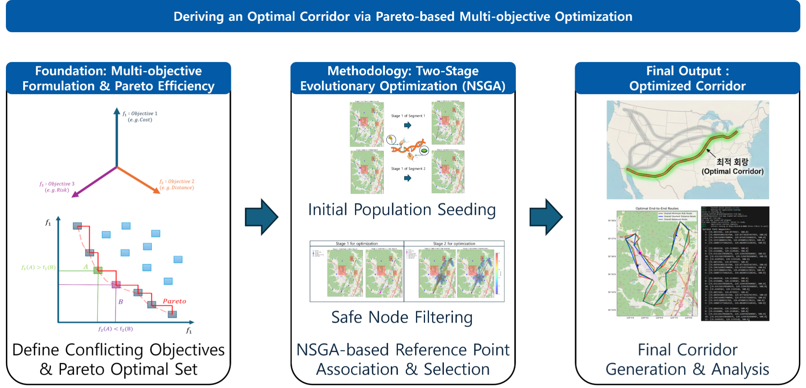

| 입력 자료 | 분석 과정 | 최종 결과 |
| :---: | :---: | :---: |
| 지상·조류·소음 위험, 지형, 장애물, 바람 | 위험지역을 피하는 여러 경로 생성 및 비교 | 목적별 최적 회랑과 균형 회랑 |

## 1. 비행하기 어려운 지역을 지도에 표시

먼저 지상 인구, 조류 활동, 고도별 공중 위험을 지도 형태로 만들었습니다. 밝거나 강조된 영역일수록 경로를 만들 때 더 주의해야 하는 곳입니다.

<table>
  <tr>
    <th width="33%">지상·인구 위험</th>
    <th width="33%">고도별 조류 위험</th>
    <th width="33%">고도별 공중 위험지역</th>
  </tr>
  <tr>
    <td align="center"><a href="./optimization_code/figure/Modified_ground_risk_heatmaps.png">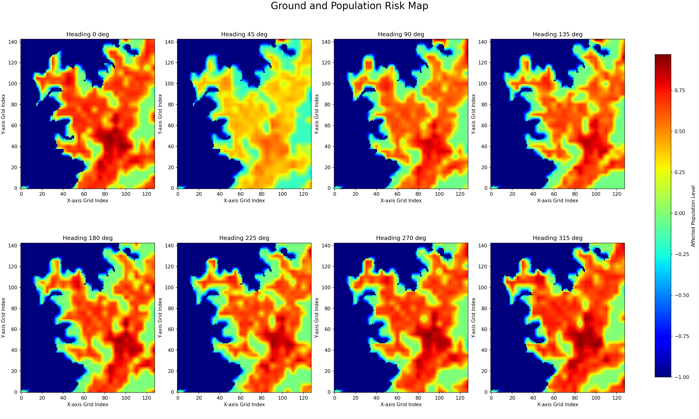</a></td>
    <td align="center"><a href="./optimization_code/figure/bird_riskmap_springfall_3d.png">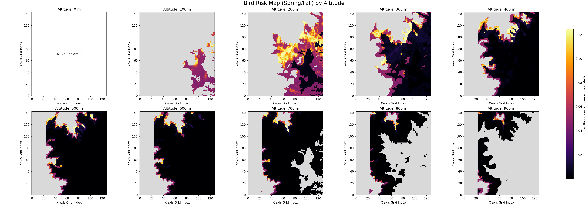</a></td>
    <td align="center"><a href="./optimization_code/figure/air_risk_heatmaps.png">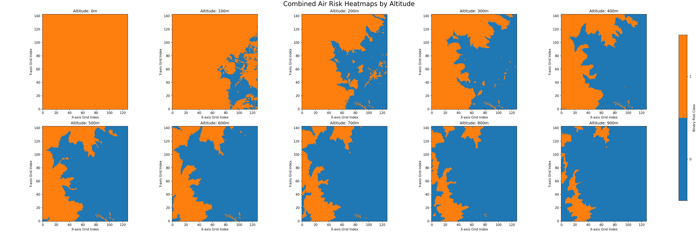</a></td>
  </tr>
</table>

## 2. 바람을 보고 이륙·착륙 방향 결정

버티포트 주변을 12개 방향으로 나누고, 1년 동안의 바람과 장애물·위험도를 함께 비교했습니다.

<table>
  <tr>
    <th width="50%">월별 바람의 방향과 세기</th>
    <th width="50%">12개 이착륙 방향 비교</th>
  </tr>
  <tr>
    <td align="center"><a href="./optimization_code/wind_data/python_outputs/monthly_wind_plot_py.png">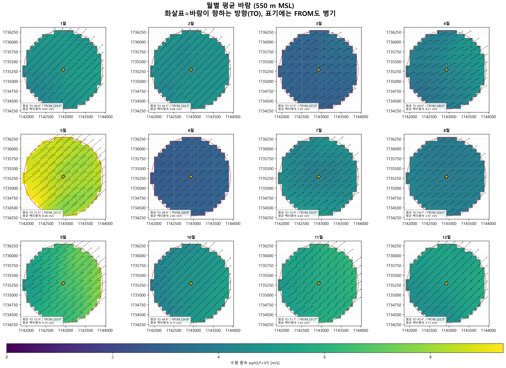</a></td>
    <td align="center"><a href="./optimization_code/wind_data/python_outputs/sector_map_diagnostics.png">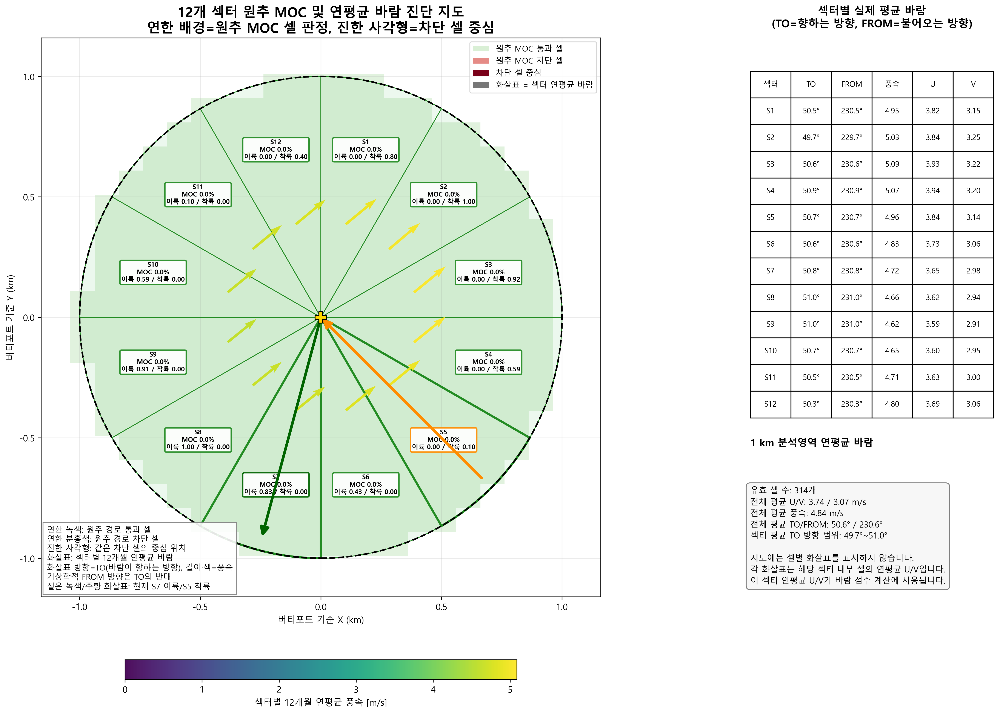</a></td>
  </tr>
</table>

- 화살표로 월별·고도별 바람의 방향과 세기를 확인합니다.
- 바람을 정면으로 받기 좋은 방향과 장애물이 없는 방향을 먼저 찾습니다.
- 남은 후보 중 지상·공중 위험이 낮은 이륙·착륙 조합을 선택합니다.

> 현재 저장된 550 m 분석에서는 132개 조합을 비교했고, **이륙 S8 / 착륙 S3** 조합이 가장 좋은 후보로 선정되었습니다.

## 3. 지형을 반영한 3D 비행경로 구성

평면에서 찾은 경로에 실제 상승·선회·순항 구간을 추가하고, 주변 지형과의 높이 차이를 3차원으로 확인했습니다.

<table>
  <tr>
    <th width="50%">분석지역의 3D 지형</th>
    <th width="50%">지형 위에 배치한 UAM 경로</th>
  </tr>
  <tr>
    <td align="center"><a href="./optimization_code/figure/uam_profile_3d_terrain_only.png">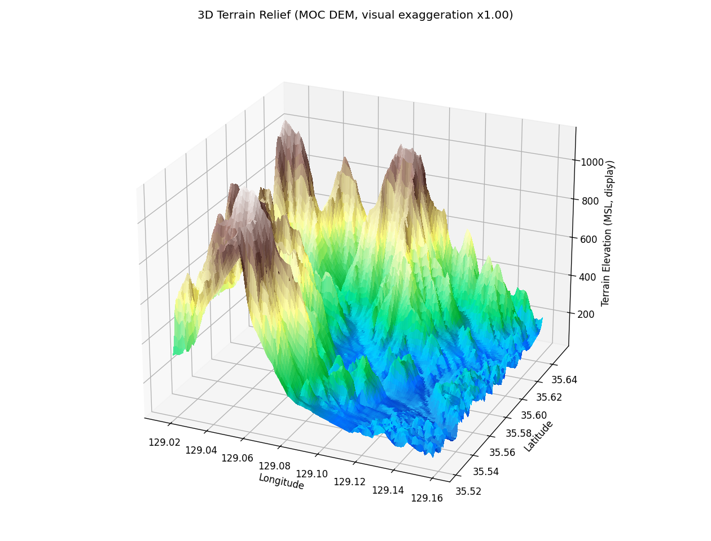</a></td>
    <td align="center"><a href="./optimization_code/figure/uam_profile_3d_route_transparent_surface.png">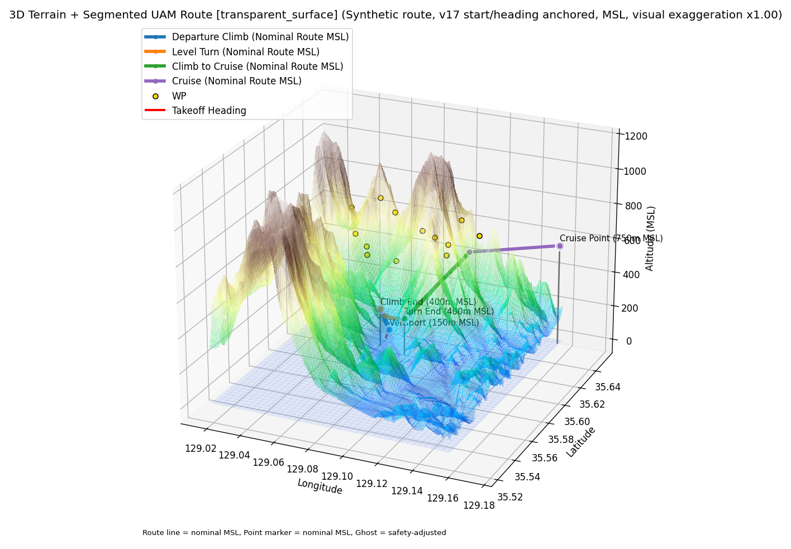</a></td>
  </tr>
</table>

경로 색상은 파란색부터 순서대로 **출발 상승 → 고도 유지 선회 → 순항고도까지 상승 → 순항** 구간을 나타냅니다.

## 4. 여러 경로를 만들고 서로 비교

한 개의 경로만 만드는 것이 아니라 다양한 초기 경로를 생성합니다. 이후 거리, 지상 위험, 공중 위험, 소음 위험을 함께 비교하여 서로 다른 장점을 가진 후보를 남깁니다.

<table>
  <tr>
    <th width="50%">생성된 초기 경로와 실제 선회 형태</th>
    <th width="50%">거리와 위험도 사이의 비교 결과</th>
  </tr>
  <tr>
    <td align="center"><a href="./assets/readme/initial-corridors-rf-450m.png">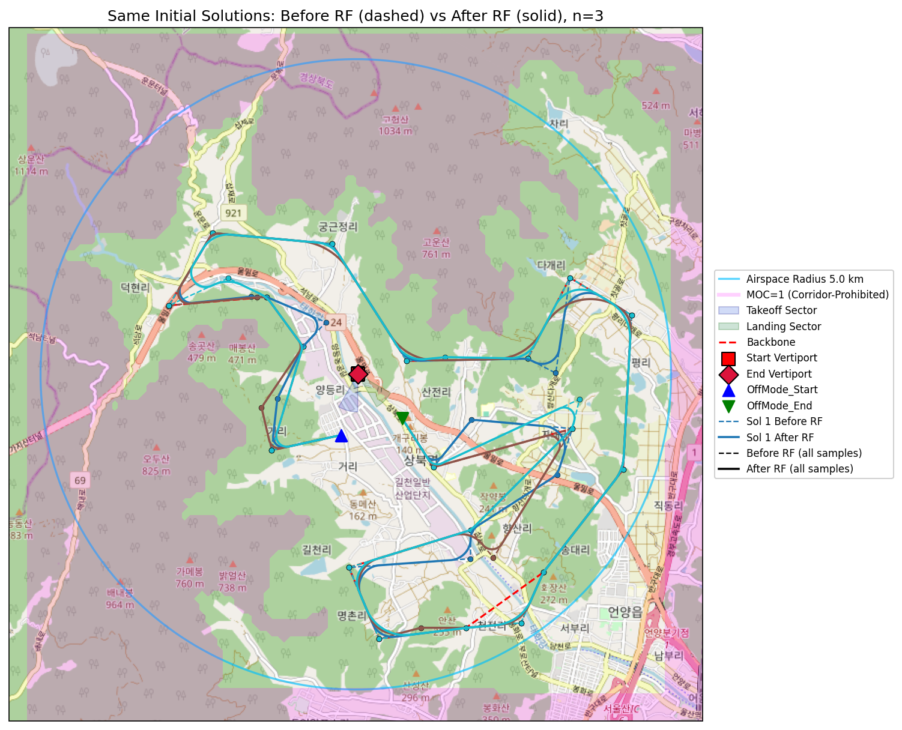</a></td>
    <td align="center"><a href="./assets/readme/pareto-analysis-450m.png">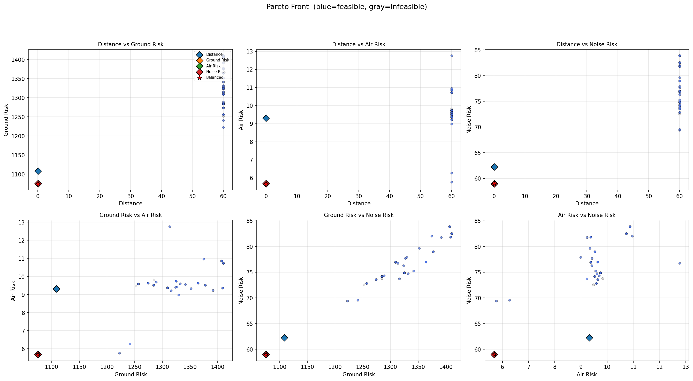</a></td>
  </tr>
</table>

왼쪽 그림은 후보 경로가 실제로 선회 가능한 곡선으로 바뀌는 과정이고, 오른쪽 그림은 한 가지 기준만 좋지 않고 여러 기준에서 균형이 좋은 경로를 찾는 과정입니다.

## 5. 목적에 맞는 최종 회랑 선택

같은 후보군에서도 무엇을 중요하게 보는지에 따라 선택되는 경로가 달라집니다.

| 공중 위험 최소 | 지상 위험 최소 | 소음 위험 최소 |
| :---: | :---: | :---: |
| <a href="./assets/readme/air-risk-corridor-450m.png">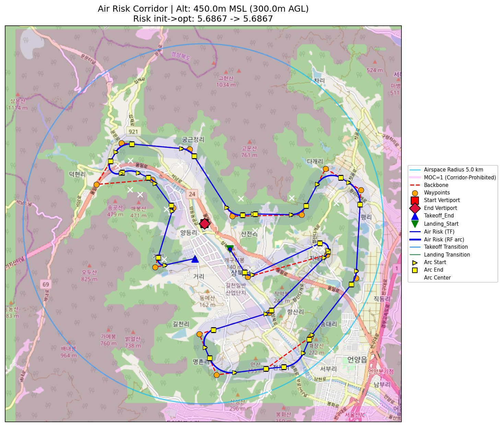</a> | <a href="./assets/readme/ground-risk-corridor-450m.png">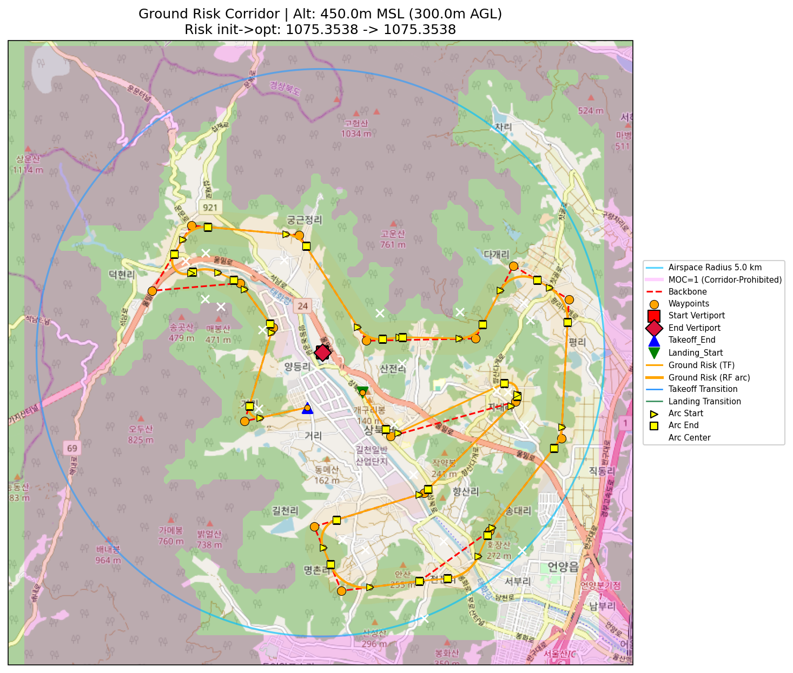</a> | <a href="./assets/readme/noise-risk-corridor-450m.png">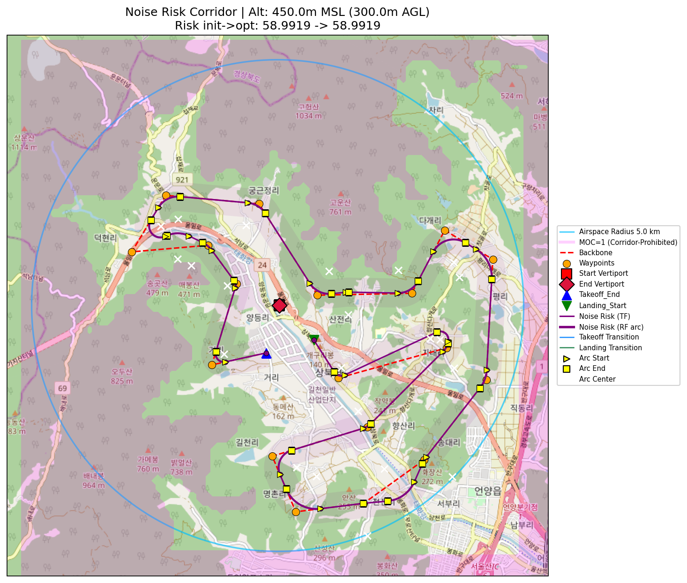</a> |

### 비행고도에 따른 차이

고도가 달라지면 피해야 할 장애물 영역과 선택 가능한 회랑도 달라집니다.

| 450 m MSL / 300 m AGL | 550 m MSL / 400 m AGL |
| :---: | :---: |
| <a href="./assets/readme/balanced-corridor-450m.png">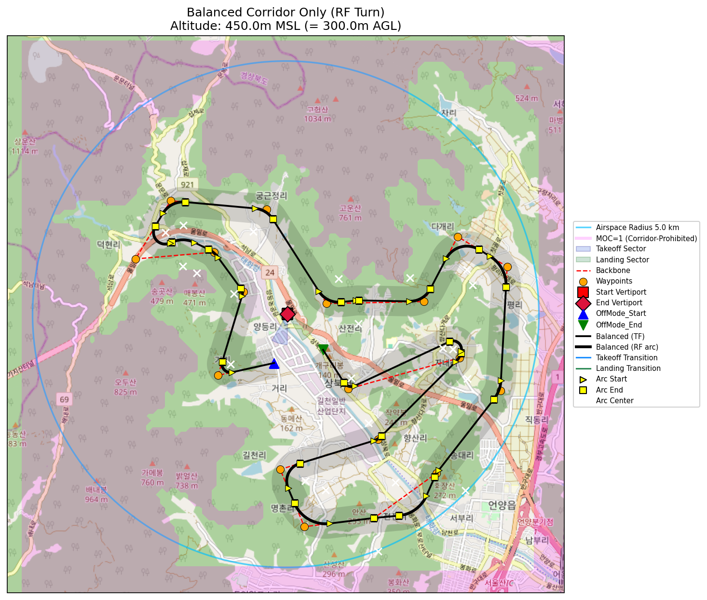</a> | <a href="./assets/readme/balanced-corridor-550m.png">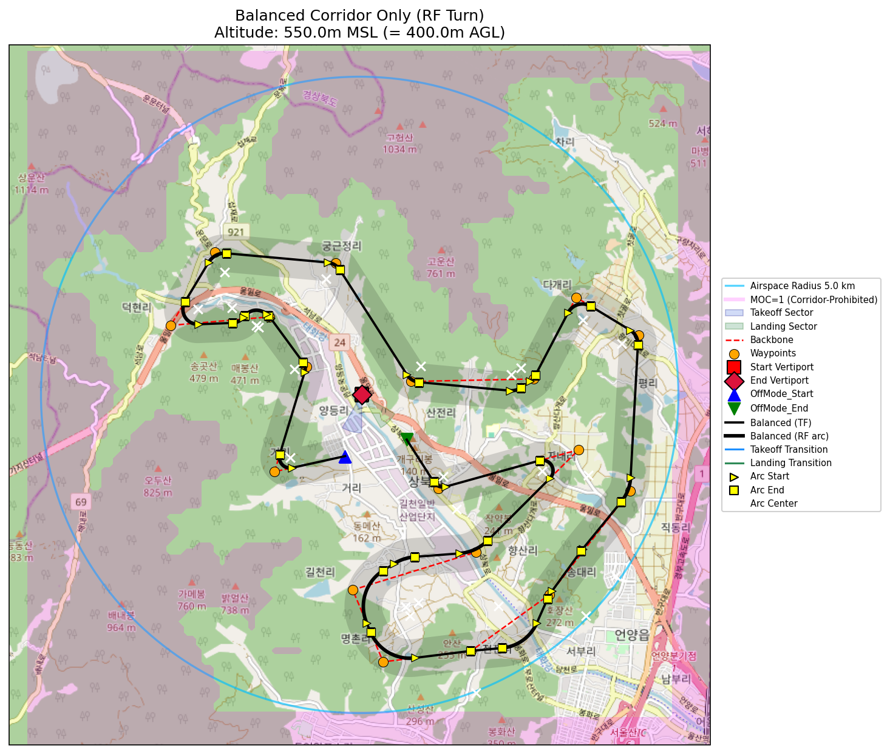</a> |

## 전체 진행 순서

| 1. 데이터 준비 | 2. 안전공간 찾기 | 3. 후보 경로 생성 | 4. 위험·거리 비교 | 5. 최종 회랑 선택 |
| :---: | :---: | :---: | :---: | :---: |
| 위험·바람·지형 지도 | 위험지역과 장애물 제외 | 다양한 경로와 선회 생성 | 네 가지 목표 동시 평가 | 목적별·균형 경로 선정 |

코드의 실행 순서와 파일별 역할은 [`optimization_code/README.md`](./optimization_code/README.md)에서 확인할 수 있습니다.
