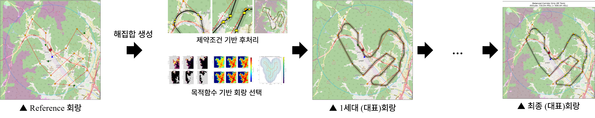

<div align="center">

# Risk-Aware K-UAM Corridor Optimization

**Pareto-based multi-objective corridor design with operational constraints**

`NSGA-III` · `Ground / Air / Noise Risk` · `RF Turn` · `MOC / NFZ` · `3D Waypoints`

</div>

---

## Overview

지상·공중·소음 위험도와 운항 제약조건을 함께 고려하여 **운용 가능한 K-UAM 회랑을 탐색하고 비교하는 다목적 최적화 프레임워크**입니다.

출발·도착 버티포트와 기준 경로를 바탕으로 후보 경로를 생성하고, 위험도 및 비행 제약을 평가한 뒤 NSGA-III를 통해 목적별 대표 회랑과 균형 회랑을 도출합니다.

> Portfolio scope: this repository overview focuses on the implementation and results in [`optimization_code`](./optimization_code/).

<p align="center">
  
</p>

## What I Built

- Built an end-to-end, risk-aware UAM corridor optimization pipeline.
- Integrated ground risk, bird-strike air risk, noise, and MOC obstacle maps.
- Applied RF-turn geometry and operational constraints to evaluate flyable corridors.
- Generated objective-specific Pareto solutions and a balanced optimal corridor.
- Exported repeatable run configurations, route data, plots, and optimization snapshots.

## Optimization Workflow

| Stage | Description |
| --- | --- |
| 1. Scenario Configuration | 버티포트, 비행 고도, waypoint, 공역 및 위험도 데이터를 구성합니다. |
| 2. Safe Node Filtering | Backbone 주변에서 위험도와 MOC 조건을 만족하는 후보 노드를 생성합니다. |
| 3. Initial Population | 기준 경로를 변형하여 초기 회랑 후보군을 생성합니다. |
| 4. Flight Constraint Check | RF turn, NFZ, MOC, 공역, 고도, 거리 및 회랑 폭 제약을 검사합니다. |
| 5. NSGA-III Optimization | Crossover, mutation, non-dominated sorting과 niching을 반복합니다. |
| 6. Corridor Selection | 목적별 대표 해와 균형 해를 선정하고 결과를 저장합니다. |

<p align="center">
  
</p>

## Objectives & Constraints

| Objectives | Operational Constraints |
| --- | --- |
| Flight distance | MOC-based obstacle avoidance |
| Ground risk | No-Fly Zones |
| Air risk | Airspace and altitude limits |
| Noise risk | Corridor width and self-overlap |
| Balanced multi-objective score | RF-turn feasibility and flight-distance limit |

## Key Results

### 1. Risk-Aware Search Space

위험도 percentile과 MOC 조건을 적용해 backbone 주변의 후보 노드를 필터링하고, 최적화가 탐색할 수 있는 공간을 구성했습니다.

<p align="center">
  
</p>

### 2. Pareto-Based Corridor Selection

거리·지상 위험·공중 위험·소음 위험 사이의 상충관계를 Pareto front로 비교하고, 목적별 대표 해와 균형 해를 선정했습니다.

<p align="center">
  
</p>

| Air Risk | Ground Risk | Noise Risk |
| :---: | :---: | :---: |
|  |  |  |

### 3. Altitude Scenario Comparison

동일한 운항 환경에서도 고도에 따라 MOC 영역과 탐색 가능한 회랑 형상이 달라집니다. 아래 결과는 두 실행 시나리오에서 도출한 균형 회랑을 비교합니다.

| 450 m MSL / 300 m AGL | 550 m MSL / 400 m AGL |
| :---: | :---: |
|  |  |

## Technical Highlights

- **Algorithm:** NSGA-III, non-dominated sorting, reference-point niching, crossover, mutation
- **Risk integration:** ground population risk, bird-strike air risk, noise, fixed-AGL MOC maps
- **Flight geometry:** TF/RF segment conversion with speed- and bank-angle-based turn radius
- **Validation:** airspace, altitude, NFZ, MOC, corridor width, self-overlap, and distance checks
- **Reproducibility:** timestamped parameters, serialized results, Excel route data, and generation snapshots

## Repository Guide

```text
kuam_corriodr_optimization/
├── README.md
├── assets/readme/                  # Portfolio images used in this README
└── optimization_code/
    ├── MAIN_uam_corridor_optimizer.py
    ├── *_GP.py                     # Population, objectives, crossover, mutation
    ├── rf_turn.py                  # RF-turn path geometry
    ├── ground_risk_data/
    ├── air_risk_data/
    ├── noise_data/
    ├── 260608_MOC/
    ├── visualization_tools/
    ├── figure/
    └── runs/                       # Timestamped optimization results
```

See [`optimization_code/README.md`](./optimization_code/README.md) for the code flow, core modules, input data, and generated outputs.

## Generated Outputs

Each execution creates a timestamped folder under `optimization_code/runs/`.

| Output | Description |
| --- | --- |
| `params.json` | Scenario configuration and optimization parameters |
| `results.pkl` | Serialized population, objectives, and selected solutions |
| `route_data.xlsx` | Final route, TF/RF segments, centers, and scenario information |
| `fig*.png` | Safe nodes, initialization, Pareto analysis, and optimized corridors |
| `gen_snapshots/` | Generation-by-generation corridor evolution |

## End-to-End Overview

아래 그림은 위험도 데이터 구성부터 후보 경로 생성, 다목적 평가 및 최종 균형 회랑 도출까지의 전체 흐름을 한 장으로 정리한 것입니다.

<p align="center">
  
</p>
