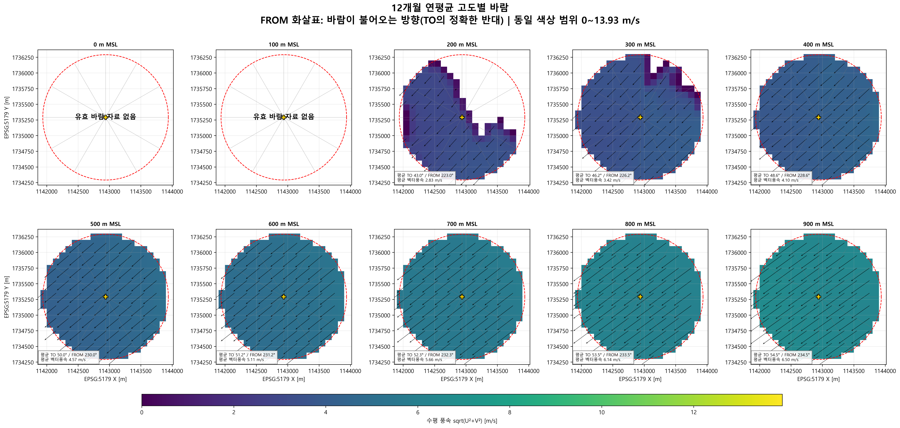
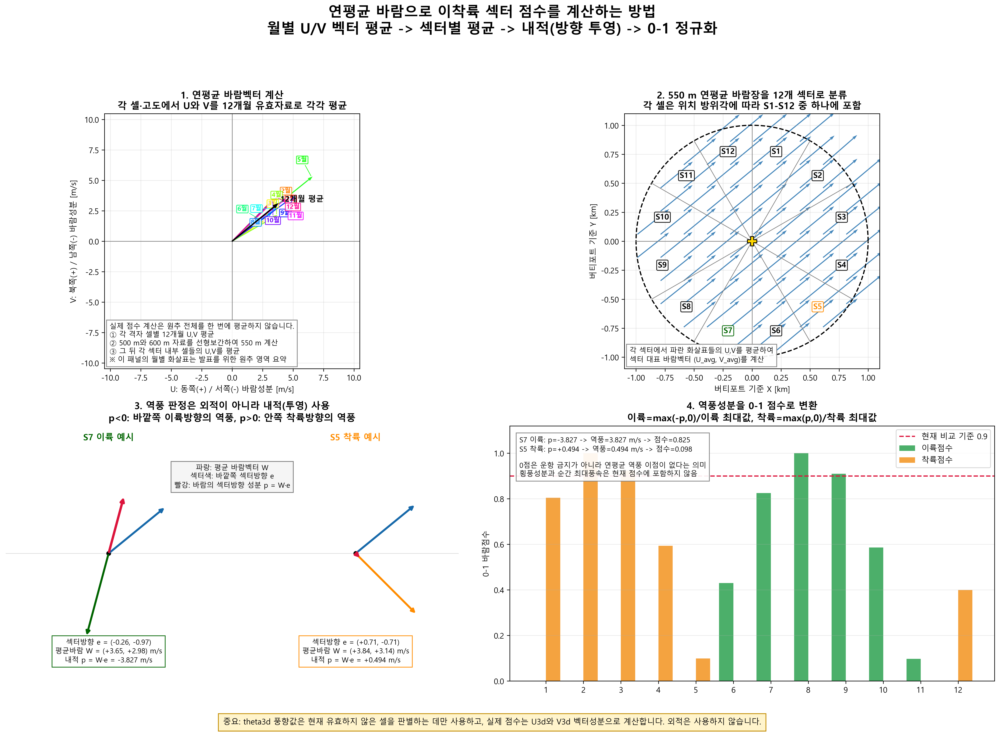
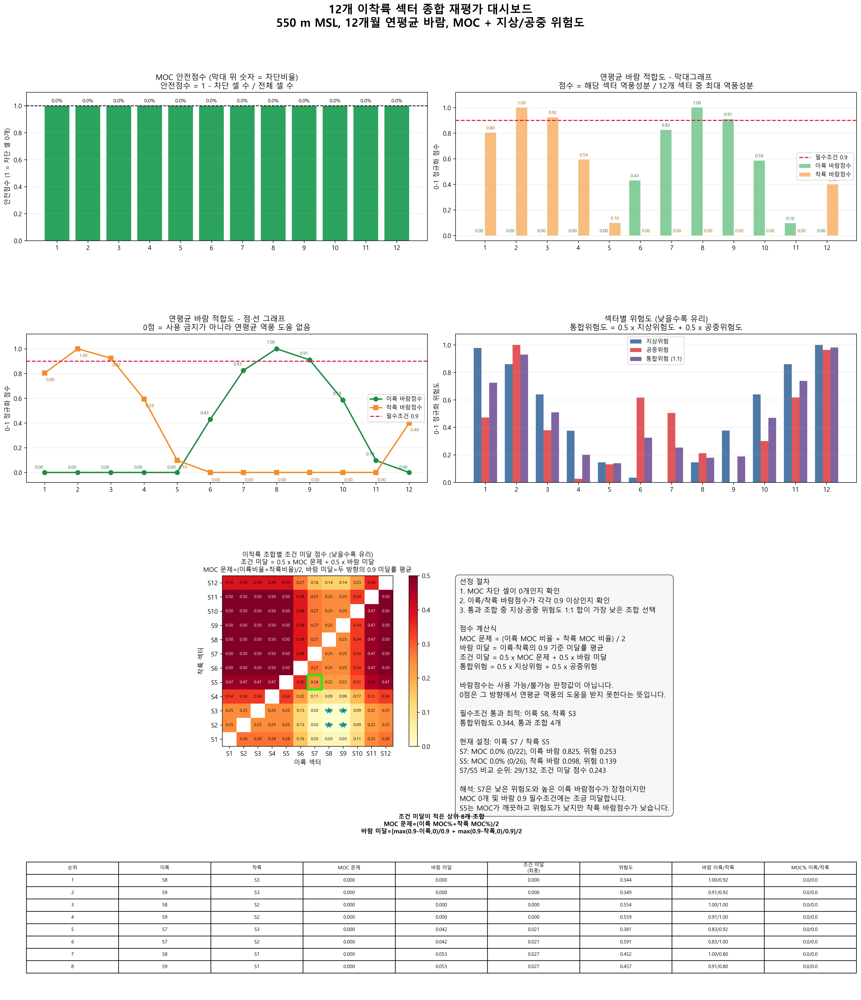
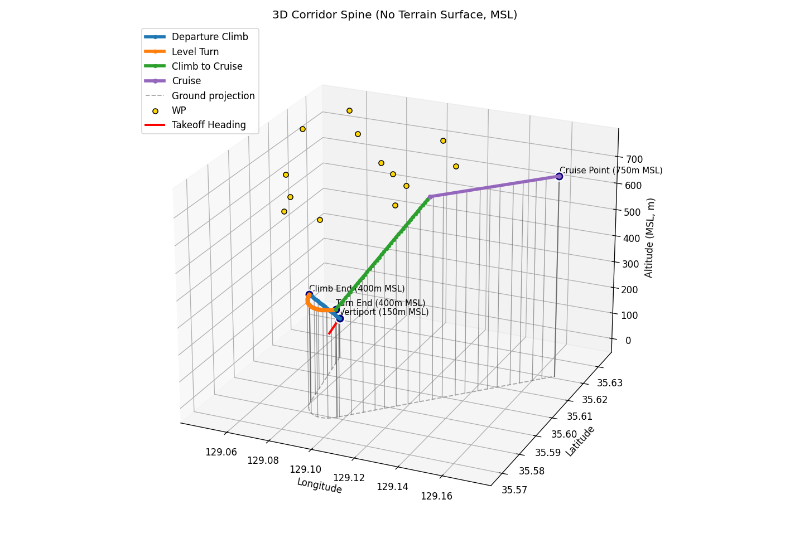
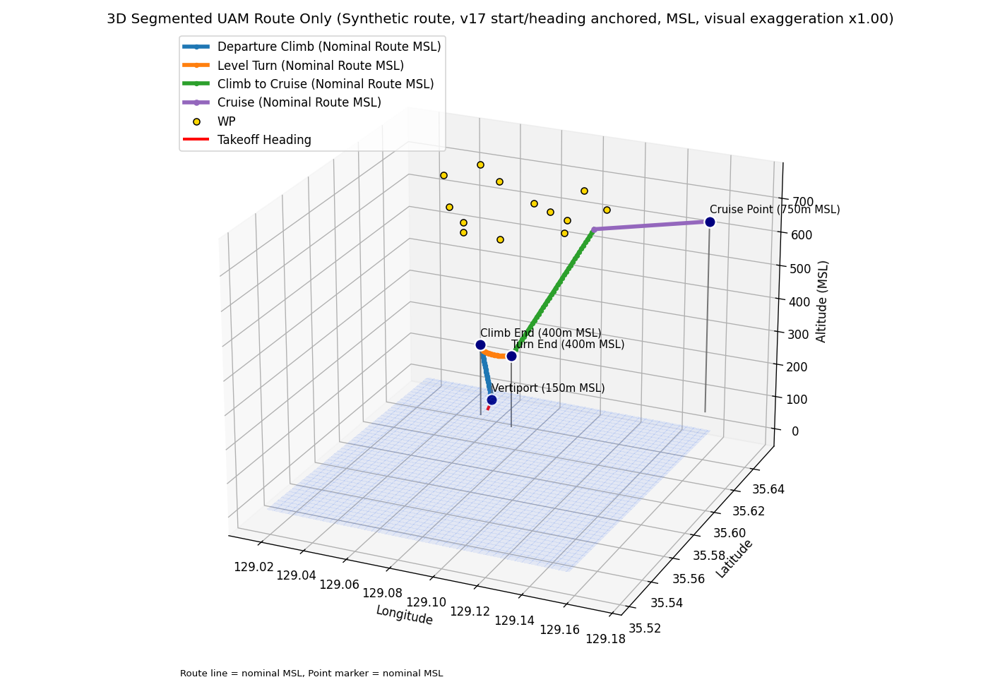
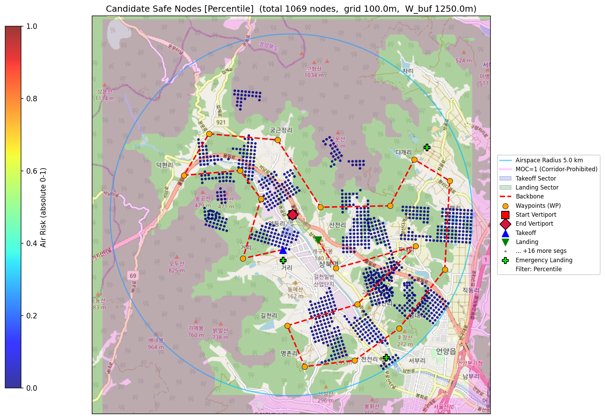

# Risk-Aware K-UAM Corridor Optimization

**Pareto-based corridor design with wind-informed vertiport sector selection and operational constraints**

`NSGA-III` · `Ground / Air / Noise Risk` · `Wind Sectors` · `RF Turn` · `MOC / NFZ` · `3D Waypoints`

---

## Overview

지상·공중·소음 위험도와 운항 제약조건을 함께 고려하여 **운용 가능한 K-UAM 회랑을 탐색하고 비교하는 다목적 최적화 프레임워크**입니다.

출발·도착 버티포트와 기준 경로를 바탕으로 후보 경로를 생성하고, 위험도 및 비행 제약을 평가한 뒤 NSGA-III로 목적별 대표 회랑과 균형 회랑을 도출합니다. 별도의 `wind_data` 분석은 월별 3차원 바람장을 12개 방위 섹터로 투영하여 이륙·착륙 방향 후보를 평가하고, MOC와 지상·공중 위험도를 함께 비교합니다.

  

## What I Built

- End-to-end risk-aware UAM corridor optimization pipeline
- Ground population, bird-strike air, noise, terrain, and MSL MOC layer integration
- Monthly/seasonal wind analysis and 12-sector takeoff/landing direction diagnostics
- TF/RF route geometry with speed- and bank-angle-based turn radius
- Objective-specific Pareto solutions and a normalized balanced corridor

## Data & Operational Modeling

### 1. Risk Layers

모든 위험도 레이어는 동일한 평가 격자와 좌표 방향으로 정렬됩니다. 현재 저장된 공간 정합 보고서는 공중 위험·연평균 바람·지상 위험을 `EPSG:5179`, 100 m 간격의 `128 × 143` 격자에 맞추고, 별도 MOC 원본 격자를 같은 분석영역에 대응시킵니다.

<table>
  <tr>
    <th width="33%">Ground / Population Risk</th>
    <th width="33%">Bird Risk by Altitude</th>
    <th width="33%">Combined Air-Risk Mask</th>
  </tr>
  <tr>
    <td align="center"></td>
    <td align="center"></td>
    <td align="center"></td>
  </tr>
  <tr>
    <td>지상의 인구·건물 피해를 나타내는 지상 위험도</td>
    <td>고도별 조류·지상 장애물에 의한 공중 위험도</td>
    <td>MSL 기준 순항시 제한되어야 할 지형 지도</td>
  </tr>
</table>

### 2. Monthly and Altitude-Dependent Wind

[`vertiport_wind_plot2.py`](./optimization_code/wind_data/vertiport_wind_plot2.py)는 `AirRisk_Data_1.mat`부터 `AirRisk_Data_12.mat`까지의 `U3d`, `V3d`를 검증하고, 목표 고도에서 보간한 뒤 버티포트 중심 1 km 영역의 월별·계절별·연평균 바람벡터를 계산합니다. 화살표는 바람이 향하는 `TO` 방향이며, 기상학적 `FROM` 방향은 `TO + 180°`입니다.

<table>
  <tr>
    <th width="50%">Monthly Mean Wind at 550 m MSL</th>
    <th width="50%">Annual Mean Wind by Altitude</th>
  </tr>
  <tr>
    <td align="center"></td>
    <td align="center"></td>
  </tr>
</table>

현재 저장된 550 m MSL 연평균 결과는 `TO 50.610°`, `FROM 230.610°`, 평균 풍속 `4.842 m/s`입니다. 고도별 패널은 저고도 유효자료 범위와 고도 상승에 따른 풍향·풍속 변화를 한 번에 보여줍니다.

### 3. Takeoff / Landing Sector Selection

버티포트 주변 1 km 원을 북쪽 기준 시계방향의 12개 섹터(`S1`–`S12`, 각 30°)로 나눕니다. [`plot_new_moc_top6.py`](./optimization_code/wind_data/plot_new_moc_top6.py)는 각 섹터의 MOC, 연평균 바람, 지상 위험, 공중 위험을 같은 공간 범위에서 평가합니다.

1. 각 셀의 12개월 유효 `U/V`를 평균하고 550 m MSL 바람장을 구성합니다.
2. 섹터 단위벡터 `e`에 바람벡터 `W`를 내적하여 이륙·착륙 역풍성분을 분리합니다.
3. 12개 섹터의 최대 역풍성분으로 0–1 정규화하고, 이륙·착륙 모두 `0.9` 이상인지 검사합니다.
4. MOC 차단 셀이 0개인 조합만 통과시킨 뒤 `0.5 × 지상위험 + 0.5 × 공중위험`이 가장 낮은 조합을 선택합니다.

| Metric | Definition |
| --- | --- |
| Takeoff headwind | `max(-W · e, 0)` |
| Landing headwind | `max(W · e, 0)` |
| Wind score | 해당 섹터 역풍성분 / 12개 섹터 중 최대 역풍성분 |
| MOC safety | `1 - (차단 셀 수 / 전체 셀 수)`; 필수조건은 차단 셀 0개 |
| Integrated risk | `0.5 × ground risk + 0.5 × air risk` |

<table>
  <tr>
    <th width="50%">Spatial Sector Diagnostics</th>
    <th width="50%">Wind-Score Construction</th>
  </tr>
  <tr>
    <td align="center"></td>
    <td align="center"></td>
  </tr>
</table>

#### Stored 550 m MSL Diagnostic Snapshot

| Item | Result |
| --- | --- |
| Evaluated takeoff/landing pairs | 132 (`12 × 11`) |
| Pairs passing both MOC and wind requirements | 4 |
| Best passing pair | **Takeoff S8 / Landing S3** |
| Best pair integrated risk | **0.344** |
| Next passing alternatives | S9/S3, S8/S2, S9/S2 |
| Reference pair in the report | S7/S5: rank 29/132, condition-gap score 0.243 |

이 결과에서 S7/S5는 MOC 차단 셀은 없지만 이륙 바람점수 `0.825`, 착륙 바람점수 `0.098`로 0.9 기준을 충족하지 못합니다. 이 진단은 저장된 550 m MSL 분석 스냅샷이며, 메인 최적화의 순항고도·섹터 설정은 실행 시나리오에서 별도로 지정됩니다.

<strong>Open the full sector-evaluation dashboard</strong>

  

The machine-readable results are available in [`sector_metrics.csv`](./optimization_code/wind_data/python_outputs/sector_metrics.csv), [`sector_combination_ranking.csv`](./optimization_code/wind_data/python_outputs/sector_combination_ranking.csv), and [`sector_selection_summary.txt`](./optimization_code/wind_data/python_outputs/sector_selection_summary.txt).

### 4. Terrain and 3D Flight Profile

2차원 최적 회랑은 버티포트 고도에서 출발해 `Departure Climb → Level Turn → Climb to Cruise → Cruise` 구간으로 확장됩니다. 모든 고도는 MSL 기준으로 관리하고, DEM·MOC 지형과 경로를 함께 표시하여 수직 분리와 지형 여유를 확인합니다.

<table>
  <tr>
    <th width="50%">Terrain Relief</th>
    <th width="50%">Route over Terrain</th>
  </tr>
  <tr>
    <td align="center"></td>
    <td align="center"></td>
  </tr>
  <tr>
    <th>Corridor Spine</th>
    <th>Segmented Route Only</th>
  </tr>
  <tr>
    <td align="center"></td>
    <td align="center"></td>
  </tr>
</table>

파란색은 출발 상승, 주황색은 고도 유지 선회, 초록색은 순항고도까지의 상승, 보라색은 순항 구간을 나타냅니다. 점선·수직선은 지상 투영과 경로-지형 관계를 확인하기 위한 보조선입니다.

## Optimization Workflow

| Stage | Description |
| --- | --- |
| 1. Scenario Configuration | 버티포트, 비행 고도, waypoint, 이착륙 섹터, 공역 및 위험도 데이터를 구성합니다. |
| 2. Safe Node Filtering | Backbone 주변에서 위험도와 MOC 조건을 만족하는 후보 노드를 생성합니다. |
| 3. Initial Population | 기준 경로를 변형하여 초기 회랑 후보군을 생성합니다. |
| 4. Flight Constraint Check | RF turn, NFZ, MOC, 공역, 고도, 거리 및 회랑 폭 제약을 검사합니다. |
| 5. NSGA-III Optimization | Crossover, mutation, non-dominated sorting과 niching을 반복합니다. |
| 6. Corridor Selection | 목적별 대표 해와 균형 해를 선정하고 결과를 저장합니다. |

<table>
  <tr>
    <th width="50%">Initial Corridors & RF Turns</th>
    <th width="50%">Pareto Objective Analysis</th>
  </tr>
  <tr>
    <td align="center"></td>
    <td align="center"></td>
  </tr>
</table>

초기 회랑과 Pareto 그림은 페이지 흐름을 방해하지 않도록 축소했으며, 클릭하면 원본을 확인할 수 있습니다.

## Objectives & Constraints

| Objectives | Operational Constraints |
| --- | --- |
| Flight distance | MOC-based obstacle avoidance |
| Ground risk | No-Fly Zones |
| Air risk | Airspace and altitude limits |
| Noise risk | Corridor width and self-overlap |
| Balanced multi-objective score | RF-turn feasibility and flight-distance limit |

## Optimization Results

### Risk-Aware Search Space

위험도 percentile과 MOC 조건을 적용해 backbone 주변의 후보 노드를 필터링하고, 최적화가 탐색할 수 있는 공간을 구성합니다.

  

### Objective-Specific Corridors

거리·지상 위험·공중 위험·소음 위험 사이의 상충관계를 비교하고 목적별 대표 해와 균형 해를 선정합니다.

| Air Risk | Ground Risk | Noise Risk |
| :---: | :---: | :---: |
|  |  |  |

### Altitude Scenario Comparison

동일한 운항 환경에서도 고도에 따라 MOC 영역과 탐색 가능한 회랑 형상이 달라집니다. 아래 결과는 두 실행 시나리오에서 도출한 균형 회랑을 비교합니다.

| 450 m MSL / 300 m AGL | 550 m MSL / 400 m AGL |
| :---: | :---: |
|  |  |

## Technical Highlights

- **Algorithm:** NSGA-III, non-dominated sorting, reference-point niching, crossover, mutation
- **Risk integration:** ground population risk, bird-strike air risk, noise, fixed-AGL MOC maps
- **Wind analysis:** 12 monthly 3D `U/V` fields, altitude interpolation, 12-sector vector projection
- **Flight geometry:** TF/RF segment conversion with speed- and bank-angle-based turn radius
- **Validation:** coordinate alignment, airspace, altitude, NFZ, MOC, sector, corridor width, self-overlap, and distance checks
- **Reproducibility:** timestamped parameters, serialized results, CSV/JSON diagnostics, Excel route data, and generation snapshots

