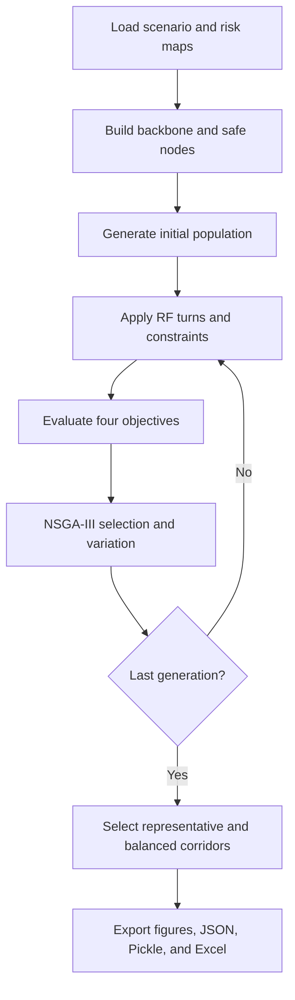

# Optimization Code

## Overview

`optimization_code` contains the primary implementation for risk-aware K-UAM corridor optimization.

메인 실행 파일은 `MAIN_uam_corridor_optimizer.py`이며, 위험도 데이터 로딩부터 후보 노드 생성, RF-turn 검증, NSGA-III 최적화, 결과 저장까지 전체 과정을 수행합니다.

## Execution Flow



## Core Modules

| Group | Files | Role |
| --- | --- | --- |
| Entry point | `MAIN_uam_corridor_optimizer.py` | Scenario configuration, optimization loop, visualization, and result export |
| Initial population | `generate_initial_population_GP.py` | Generates corridor candidates around the reference backbone |
| Objective evaluation | `evaluate_objectives_with_constraints_GP.py` | Evaluates distance, ground risk, air risk, noise, and constraint violations |
| NSGA-III | `fast_non_dominated_sort.py`, `generate_reference_points.py`, `normalize_objectives.py`, `niching_selection.py` | Pareto sorting, normalization, reference association, and survivor selection |
| Genetic operators | `crossover_GP.py`, `mutation_GP.py` | Produces and perturbs candidate corridors |
| Flight geometry | `rf_turn.py` | Converts waypoint paths into TF/RF segments and validates turn geometry |
| Flight sectors | `takeoff_landing_sector.py` | Builds and checks takeoff/landing sector conditions |
| API layer | `api_service/` | Exposes the optimization engine through an optional service interface |

## Input Data

| Directory | Input |
| --- | --- |
| `ground_risk_data/` | Ground population and consequence-based risk map |
| `air_risk_data/` | Altitude-dependent bird-strike air-risk map |
| `noise_data/` | Lden-based noise-risk grid |
| `260608_MOC/` | Fixed-AGL obstacle/MOC maps |
| `wind_data/` | Seasonal and monthly wind-analysis data |

The current evaluation grid covers the configured Ulsan operating area. Coordinate bounds and grid orientation must remain consistent across every risk layer.

## Optimization Stages

### 1. Configure the Scenario

The main script defines vertiports, cruise altitude, airspace radius, transition sectors, corridor width, NFZs, and optimization parameters.

### 2. Construct Candidate Nodes

Candidate nodes are generated around the route backbone using a configurable grid and buffer. Risk percentile and MOC checks remove unsuitable nodes before optimization.

### 3. Generate and Validate Corridors

Initial paths are sampled from the candidate-node pool. RF turns are applied and each corridor is checked against flight geometry and operational constraints.

### 4. Run Multi-Objective Optimization

NSGA-III evolves the population using crossover and mutation while retaining non-dominated and diverse solutions.

The evaluated objectives are:

- Flight distance
- Ground risk
- Air risk
- Noise risk

### 5. Select and Export Results

The optimizer selects representative objective-specific solutions and a normalized balanced solution, then exports the route and diagnostic results.

## Running the Optimizer

Run from the `optimization_code` directory so that relative data paths resolve correctly.

```powershell
cd optimization_code
python MAIN_uam_corridor_optimizer.py
```

## Generated Outputs

Each run creates `runs/<YYYYMMDD_HHMMSS>/`.

| File | Description |
| --- | --- |
| `params.json` | Complete scenario and optimizer configuration |
| `results.pkl` | Population, objective values, selected paths, and supporting data |
| `route_data.xlsx` | Final balanced corridor with route, CR points, RF centers, and scenario sheets |
| `fig1*.png` | Safe-node and MOC diagnostics |
| `fig2*.png` | Initial population and RF-turn comparison |
| `fig3_pareto.png` | Pairwise Pareto objective plots |
| `fig4*.png` | Objective-specific representative corridors |
| `fig5*.png` | Balanced corridor visualizations |
| `gen_snapshots/` | Corridor evolution by generation |

## Directory Structure

```text
optimization_code/
├── MAIN_uam_corridor_optimizer.py
├── crossover_GP.py
├── mutation_GP.py
├── evaluate_objectives_with_constraints_GP.py
├── fast_non_dominated_sort.py
├── generate_initial_population_GP.py
├── generate_reference_points.py
├── normalize_objectives.py
├── niching_selection.py
├── rf_turn.py
├── takeoff_landing_sector.py
├── api_service/
├── ground_risk_data/
├── air_risk_data/
├── noise_data/
├── 260608_MOC/
├── wind_data/
├── visualization_tools/
├── figure/
└── runs/
```

## Additional Documentation

- [`MAIN_UAM_CORRIDOR_OPTIMIZER_DETAILED_GUIDE.md`](./MAIN_UAM_CORRIDOR_OPTIMIZER_DETAILED_GUIDE.md): parameter-by-parameter description of the main optimizer
- [`PROJECT_FILE_USAGE_AND_OUTPUT_GUIDE.md`](./PROJECT_FILE_USAGE_AND_OUTPUT_GUIDE.md): file roles, data sources, and output details
